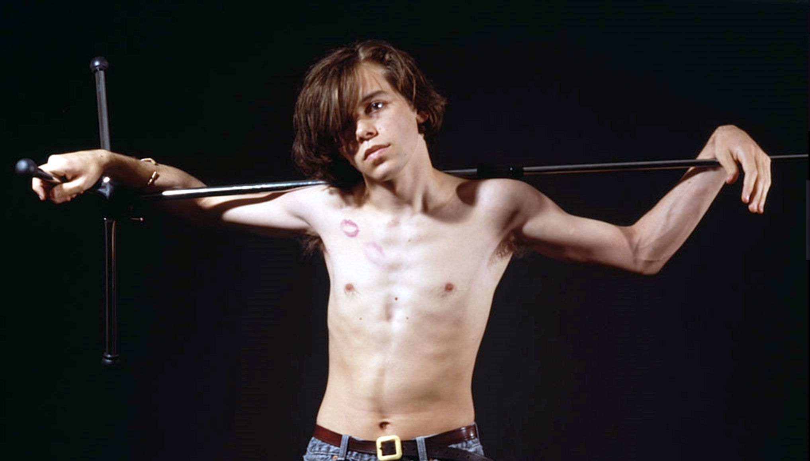
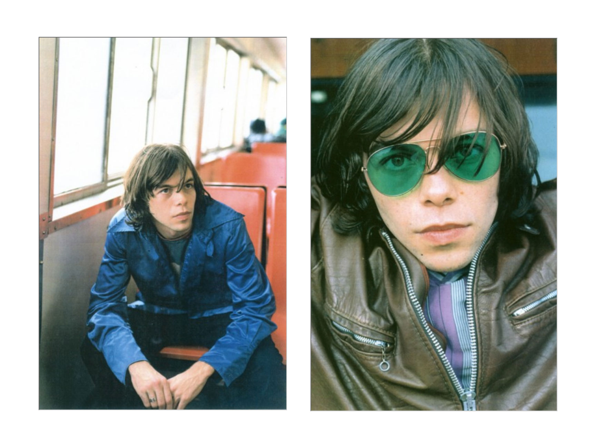
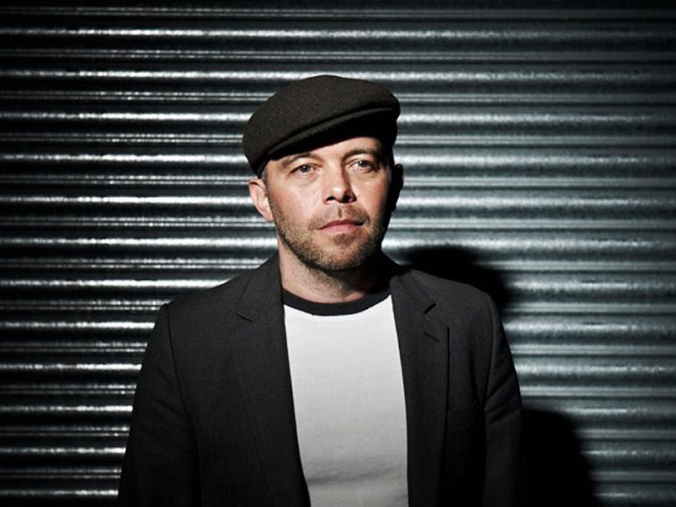

<figure>

</figure>

# Mark Gardner on growing into fame

*Ride started in 1988, at the time both lead singer Mark Gardner and guitar player Andy Bell fresh out of high school. The band was almost discovered by Alan Mcgee and signed to Creation Records. They rapidly surpassed even their own conceptions of success. Just two years after their inception all three of their eps had hit the Uk top 75, at the time lead singer Mark Gardner was only nineteen. Gardner now 47 lives in his home town of Oxford splitting his time between producing, being a father and performing in Ride. We talked about suburban mundanity and his abrupt fame.*

**How’d you get into playing music?**
My uncle played guitar a bit so he was a real introduction to it. He was the kind of guy who took me under his wing, he was this fun guy in my life, he was a biochemist. He was the guy who started to play me rock n roll, people like the Beach Boys and The Stray Cats, among others.

**How was your uncle different from other adult figures?**
He was a madcap kind of character, and looking back he suffered a bit from depression, but obviously I was his nephew and he was a bit nutty around me in a fun good way. And when I went to see him it was the first time I was away from my mom and dad and he was explosive and made things bang, and he played rock n’ roll loud. I never got that at home. He was my dad’s brother, I loved him definitely a big part of my making it for sure.My uncle died when I was twelve, which really affected me in a serious way because I’d never lost anyone I was really close to. He was the first one. Really I was struck down by that for a while.

**Were there other ways you rebelled against the mundanity you felt you were experiencing?**
Getting on the motorbike going into the city, drinking, smoking, getting high. There was quite a lot of hash, it wasn't strong really but it was a big Caribbean influence in Oxford where my uncle lived and my dad grew up. I gravitated back to that area and that was where I ended up getting a house, because it was close to a place I could buy pot. And that’s East Oxford and that’s where I still live, and it’s very cosmopolitan and multicultural, and it’s always been surrounded by a conservative blue thing, but it’s a place I love and I’m still here, I’ve lived away lots but these are kinda my roots I suppose. I would alter my consciousness and see how it would affect my art. I didn't turn into a big drugger but I definitely experimented and drugs were always around me.

<figure>

</figure>

**What was up with the motorbike?**
I would sometimes illegally ride them around when I was younger, I bought a terrible old motorbike, from a dump sort of place for things on their last legs, and I sort of would go around fields, and that was a real early buzz for me for sure. Another friend of mine had a sort of Lambretta scooter. We used to go out across the fields, that was a real buzz.

**What were you like while living in the country side?**
I was just really single minded and obsessed at that point as escapism, as the ultimate sort of force in my life. I just adored music and listened to it, music was my only friend, I was kind of a bit of a loner in the countryside really, so I was always playing music at home.

**Do you remember your first experience composing songs/ writing your own songs?**
When I was fourteen or fifteen there was Richard around here, kind of a thespian. The three of us would hang out, with Andy. That was the first time we started to write and play and make our own songs. We were probably pretty dreadful, but it was a start you know?

**You mentioned the first experience you had with singing was musical theater, could you talk about that?**
It was one of those things I thought that I was missing out. I did Grease I just thought give it a go. I once got stage production duty, and that guy gets a few songs, so I ended up competing with Steve-from-Ride’s younger brother. He looked the part and he got it, but people realized I could sing, so they gave me an extra couple of songs. That was the first time I really stood up with a mic and sang out loud. I really loved the buzz of it, but I wasn’t on a mission to try and be an actor; it was all about the music. It was just the first thing that made me kinda stand up and sing live to a room of 300 people and it seemed like Wembley Stadium; it was terrifying but it was good.

**Do you remember the first time you ever met Andy Bell?**
We hung with different crowds. I hung out with a bit more hip-hoppy/casual tough guys. And Andy was more geeky, but I’d say he was kinda cooler honestly. I was more geeky because I had to hang with those idiots. It was a rough school, you had your fight and people would leave you alone. As time wore on I sort of started to get more involved in the people Andy was with and it was a bit smarter, a bit less of needing a gang around you; that’s how that worked. I do remember we did gravitate strongly with artwork together, and we were always going to the music shop to play guitars, and never bought anything. We would go out and smoke cigarettes by the logs outside of school and there was a great park by our school that looked down on the city of Oxford. We talked a lot about music. That’s how you start to form your dreams a little bit, I don’t mean to sound corny about it, but it’s true.

**Upon meeting Steve and the other members of Ride how did the way you dressed/acted the way you changed influence from being w each other?**
I got more confident, got more broken away from the breakdance sort of phase, I still did a bit of graffiti here and there. I was definitely quite inspired by people like Johnny Marr and his look when I was in my late teens, I thought he was very cool, and of course Andy was more inspired at that point by Keith Richards and all that. I started dressing more individually, long pants and coats.

<figure>

</figure>

 **Ride started when you guys were very young; was that an overwhelming thing to have it happen so quickly?**
Completely overwhelming, yeah. It all really started to happen after we left that school, although the seeds of it were sewn with me and Andy at school. There were two art schools in Oxford, and we both ended up getting in the same one. It was an art school which was in a really rough town called Banbury, and that was the first time that we left home. I was eighteen. That was a crazy time. Mad.

We met Loz, who at that point said he played drums a bit, we didn’t realize he was a drum demon. That was completely random. Steve was around but not really completely committed. Once he met Loz, which was quite early on in that year, then we would get together at Loz’s mom's place in a random village, and Steve would come out to where we are and we would rehearse, and we all lived in the same student house in the end.

**What was it like being away from home for the first time?**
It was pretty dark times for all of us, and it felt like everything was falling apart really, and it was the first time I had properly fallen in love and then that fell apart, and then we were all away from home, and trying to find your feet, and Banbury was a rough town they didn't like artsy people, and you had to watch yourself a little bit. I remember feeling it was weird dark place really, but the one thing that came out of all the things that were going wrong I started to see how much the music thing meant to us. We kept playing and playing and we did a couple little shows, one of those supports the guy who ran the venue sent the tape to someone at Warner Bros and it was only going to be a year foundation and at the end of the year everyone would go to university and figure out their major, and for us we’d gotten some calls from Warner Bros records and yeah we were signed. Well we weren't signed then but I realized then that it was just from one tape I couldn't believe it and suddenly we were speaking to record labels. I remember I was taking a practice art history exam and I got the call and suddenly I was talking to someone from Warner Bros, It floored me.

**Did it scare you in any way?**
At that point I was pretty fearless. If it all went wrong, I wouldn't be on the streets and homeless. And also it kind of just put in something that I had to prove my dad wrong in a way, it was a classic father son thing where you kinda want to find your own identity, you want to find your own way, and it did really fuel me. I knew I had to make this work, because I was going against all the advice that I was being given, which was good advice, but I rejected it all, and I was very single minded.

**You mentioned escape - how did traveling affect you when you starting touring?**
It was great. With the band you didn't have time to absorb everything. It was looking at something in a bubble, but I never thought I’d be going to places like Japan or America. I remember when I went to America and I was met by a limo and driven to New York and we were shut in a room and did two or three days of interviews. I was like, holy shit I'm in New York. It was insane, then of course we traveled through Europe. At times it would get a bit much because it just never stopped.

**How did your parents react?**
I think they were quite blown away. My dad wouldn’t admit it right away but I heard him saying to an ex girlfriend years ago that he was proud I’d ignored his advice and it had worked out. In the end he was happy, and it was such a random career choice.

**You mentioned this fearless feeling, do you think this helped you complete things?**
Yeah, I think so. I think one thing my dad says is that you have this courage to fare in away, that always stuck with me. I ended up doing my best, I ended up doing everything and more that my uncle wanted to do. I felt it was destiny in a way, I felt that he was sort of with me, his energy. I always felt he was around. It was the guitar that I first played, it was his guitar, just things like that, his energy was all around. It was just more that was my dream. It was something that I was always gonna try to make happen. I was just so driven towards that, and I was all about escape, and all about escaping my reality, and my reality was quite mundane, sort of a country life I was rebelling against and do something that would open up opportunities.
When I was fourteen or fifteen my dream was to play in a band in a theater in Oxford, and if I could ever do that, that would have been incredible. That was the limit of my realistic ambition at that point, so what happened just blew that out of the water completely.
