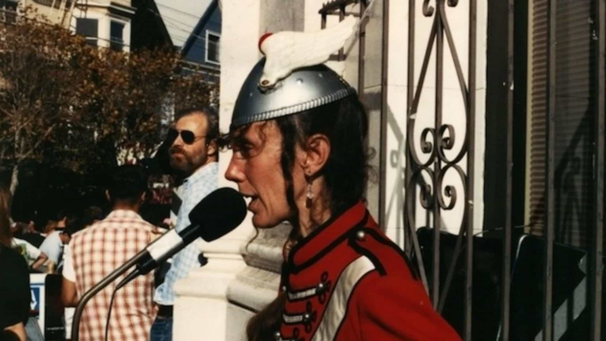
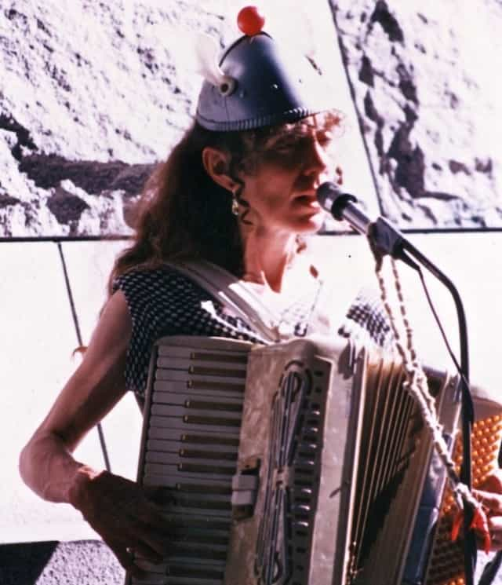
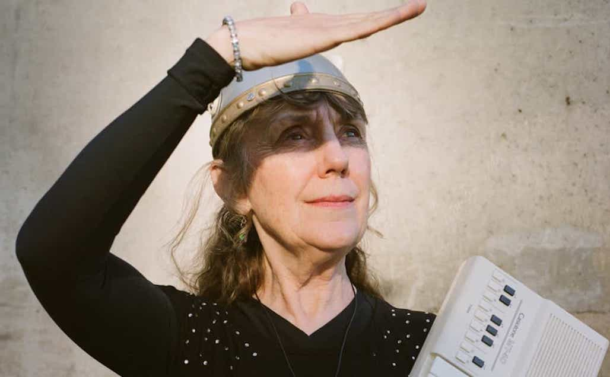
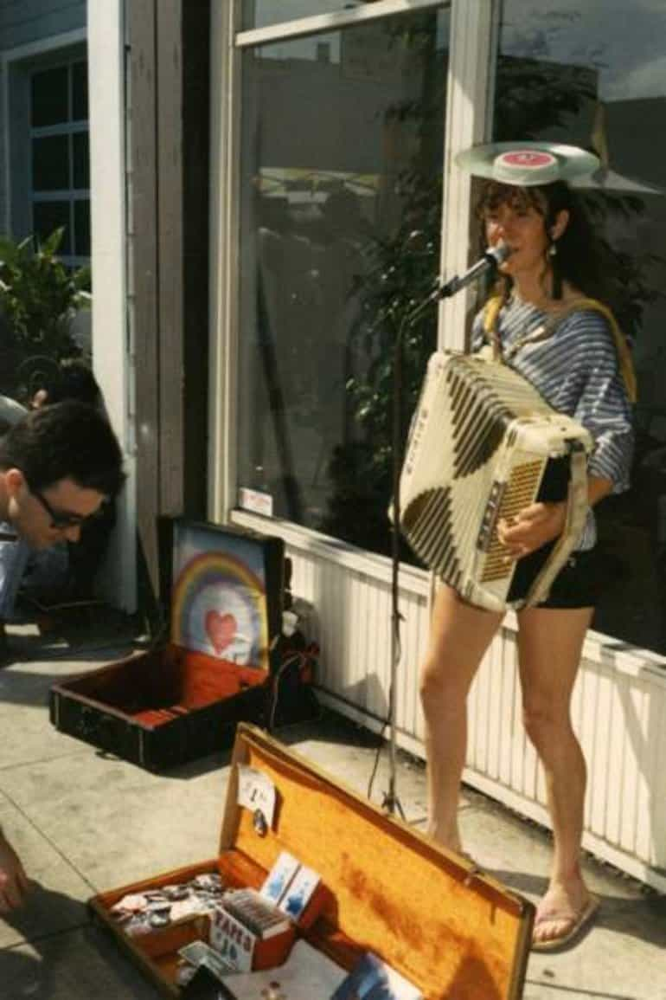

# The space lady gets down to earth

<figure>

</figure>

*For 16 years Susan Dietrich Schneider AKA The Space Lady supported her family by busking the Streets of Boston and San Fransisco in a wigged helmut covering songs like “Major Tom” by David Bowie or penning her own like “Synthesize Me”. Her life was lived on the outskirts. Slowly the Space Lady ascended from the streets to night clubs gaining a bigger and bigger fan base with time and age. Susan is now 70 after a brief hiatus in 2000 she returned with a triumphed message to fans “ The Space Lady is back!”. After speaking with Susan it became clear that the Space Lady is not just a performance but the vehicle in which Susan could really come out of her shell and away from her toxic abusive relationship relationship with her then husband Joel Dunsany. The Space lady has landed once again…this time on two feet.*

**You mentioned that you’ve returned to Colorado. How does it feel to be back?**
A big sigh of relief, spiritually and emotionally. I spent so many years freezing my ass off in Boston and then San Francisco. I came back to this high and dry climate, and the sun just beams down all year long. I was happy to return to my parents who I’d abandoned totally for ten years.

**Were they surprised?**
They had written me off as a lost cause. Even when we reconnected they couldn’t relate to my lifestyle or anything we were up to but they were so accepting and didn’t interfere, even if we may have needed some interference.

<figure>

</figure>

**Had you seen any family before this?**
In 1980 they sent my uncle looking for me on the street because they had all heard I was peddling my artwork on the streets of Boston and lo and behold… My uncle was also my dad’s twin brother, so I wasn’t sure if I was looking at my uncle Al or my dad, who had suddenly gone hippie himself in his 50s. I just flew into his arms and gave him a big hug. I was so thankful. I was experiencing incredible guilt and remorse over having cut off my family but as years went by it was better for them to think I was dead.

**I feel like there was a lot of common experience with that in the 60s youth movements: removing yourself from your family but that dissociating being hard, tragic, and dark instead of freeing.**
It was not at all freeing emotionally. I partially believed Joel [my ex husband] when he said they would be a threat, and I was so afraid. He was also afraid of his stepfather in the FBI. It’s hard to admit, I was so easily manipulated and unsure of myself. I really hadn’t developed any principles to live by except “don’t eat animals.” I was steadfast about that, but gosh I didn’t know how to be honest, or have open communication, or bare my soul.

**Where did your shyness and fear stem from?**
I had major trauma in my high school years from my first boyfriend dying on the football field; he got hit in the head, died in the hospital during brain surgery. I had no support. I just marvel at that fact. There’s a need for grief counseling for young people who are faced with the death of a loved one.

**You’re doing pretty well in spite of that fear, though.**
I just forge ahead if I’m onstage and I make a mistake that is obvious, I say, “that’s ok.” I allow myself 3 mistakes per show, and more if I need ‘em. That’s my attitude now towards myself. But of course, I am such a sophisticated musician with that blinking helmet on my head. I don’t wanna let people down, and if they see right away that I’m really a buffoon—that blinking light on my head, what elegance—wearing the helmet gave me the ability to laugh at myself.

**You mentioned expression being difficult for you. Has it gotten easier? Coming out of that trauma, did expression ever feel easier, and if so, when?**
After I had my first baby. It transformed me and my relationship to myself. I was just so empowered by the fact that I could create something as beautiful as this infant in my arms, and I could actually pull off giving birth. I just kept looking at people on the street and thinking, “every one of these people was born, and everyone had a mother who gave birth, so I [can] do it.” I had no prenatal care, no doctor, it was just me and Joel against the world. Just us winging it. I had a very smooth and easy delivery, and then there was this infant just glowing, radiant. I had never seen anything so beautiful and perfectly formed as she was. There was no experience as positive that could just cover up the negative views I had of myself.

**Did you support the family primarily through busking?**
Absolutely. There was not another penny to be had, because we were living alone, off the radar. We couldn’t get jobs or welfare or anything like that.

**Where did you live?**
We had a series of crash pads—friend’s floors, and sleeping in our car, and finally we landed in the basement of an apartment that was completely unfinished and unlivable. It didn’t meet any kind of standard codes, but they had electricity, running water, and a toilet, so we squatted there and stayed there for our last five years in San Francisco.

<figure>

<figcaption>
The Space Lady Today photographed by Terri Loewenthal
</figcaption>
</figure>

**When did you start distancing yourself creatively from Joel? Or feeling your own creative agency, separate from him?**
Mostly when I decided to give up peddling artwork on the side of the street and take that beat up old accordion to the subway. He did not want me to do that. I wanted to do something dignified and worthy of my child, Chrissy, not just myself. I was a mother now. I was her mother. I actually pulled it off. I deserved something more than just humiliating myself in public. It was such a transformation, it was almost like having Chrissy all over again.

**Do you remember the first time you did that?**
I did a few Irish tunes down in the subway in Boston, and Joel was absolutely terrified that not only would I not make money, but the accordion might be stolen or damaged. I made a whole twenty dollars on the first day. An elderly couple came by and dropped a twenty dollar bill in my box. Looking back on that recently, I wondered if the poor couple made a mistake.

**You’ve described yourself a lot as shy, so I was wondering about your performance in a public space.**
You know, so many people have told me that, but for me performing in public spaces was just continuing to be the wallflower as people flooded by. Not only that but it was like people came to me to give me money, I didn’t have to go up to people and ask, which was always mortifying and really hard for me. Nobody noticed unless they were kindly people, or they really liked what I was doing, and I liked what I was doing—figuring out the songs. It just sounded good too.

**A lot of the time your music is described as uplifting, and you described it once as life affirming; why is that important to you?**
I became more and more aligned with positivity, and the importance to being happy, loving, heart-centered in all you do-because we are all little infants, we never outgrew infancy or childhood. We all need nurturing forms of love and community.

**I find there’s something intuitive and spiritual to making music. It feels like kind of a religious experience.**
It’s precious. Spiritual. I love that you use the word “intuitive”. Natural. Effortless. It’s a gift. it really feels like it comes from elsewhere and flows through me. A corny word, “channeling,” but it just about hits the nail on the head. Inspiration comes from out of the blue. I can’t take credit for it. Experimentation plays a big role, making mistakes takes a big role. Just have to have the courage to do it.

**Why did you stop in 2000?**
I turned my back on Joel, and turned my back on California and the Space Lady. To me at the time The Space Lady was a complete exercise in futility, stupidity and irresponsibility, and I could hardly stand to think about what I’d done with my life. But there was still that glimmer… Maybe it wasn’t all bad. So I had my cassette turned into a CD. It got put up on the internet and circulated worldwide with my name, and my fan base kept growing.
I had partially given up on that, though. I had gone back to college in fact, and gotten a degree as a nurse and started working here as a geriatric nurse in a nursing home.

<figure>

</figure>

**What was the return to Space Lady like?**
To me playing on stage was far more fearsome than death. On the street no one was stopping to see how good or bad I was, no one was paying attention. Maybe they’d give me a quarter or a dollar but playing on stage was so scary. My first on-stage appearance was in a closet, a warehouse that felt like a garage. It was so low-key and people were so enthusiastic and welcoming that I realized it was not gonna be so formal and clunky. It was more countercultural, and I could be completely at ease with this show. It was gonna be great and I didn’t have to worry. It was another transformation in my life, the realization that could be so appreciated, and I could do what I could pretty much do in my sleep and people liked it so much.

**To wrap up I have some questions on some more general topics. To start off What do you think about “cool” as a concept? What is coolness to you?**
When you think about the literal meaning, it kinda means detached, it means cold. Not quite “cold”, but getting there.

I also think a lot of the popular vernacular evolves right out of the black artist community. That’s probably where the word “cool” came from, quite possibly out of survival; not showing any vulnerability, not showing any fear towards fellow African-Americans or, god forbid, the white super culture or over culture. So “being cool” was a matter of survival, keeping your heart rate level and breathing slowed. Being able to look people in the eye without flinching. I can’t even imagine growing up in a place where knives, guns, hard drugs, prison, and domination and rampant racism were everywhere, and trying to survive in that-you would have to learn how to be cool in every sense of the word. Just be cool.

**Up next… What do you think of morals?**
I think the word “moral” is so much baggage, regiment...yet when you consider what’s going on at the highest level of government, there is a definitely a lack of morals. It’s really hard to separate all the triggers that it pulls. It’s morals which are so important. And yet morality can just seem like a rigid, frigid place to not experiment or wiggle around too much or god forbid break norms break rules you know.

**Do you think it will get easier?**
It’s hard to imagine how any life form is going to survive the next 100 years, even 50. I don’t know if the planet will survive radiation, or the insecticides, nerve agents, and atomic blasts that seem likely. How? How will the planet be left? So here I am, a messenger to the cause, beaming up positive hope and optimism, but behind the scenes the Wizard of Oz is not so sure. I’m scared shitless myself, and that’s why we need each other. It’s the scariest thing in the world- in the universe, but in my little nutshell existence, I still get up onstage and I’m shaken in the light, I’m scared I’ll blow it, and make a fool of myself.
